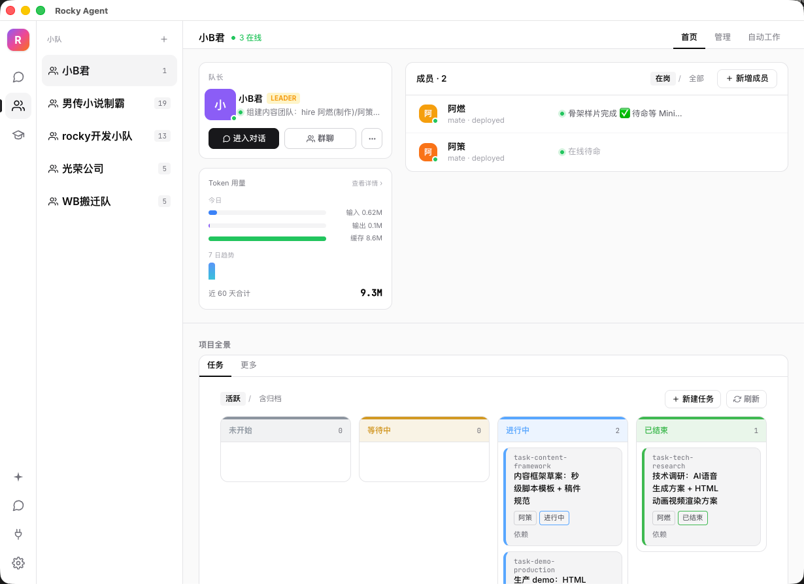
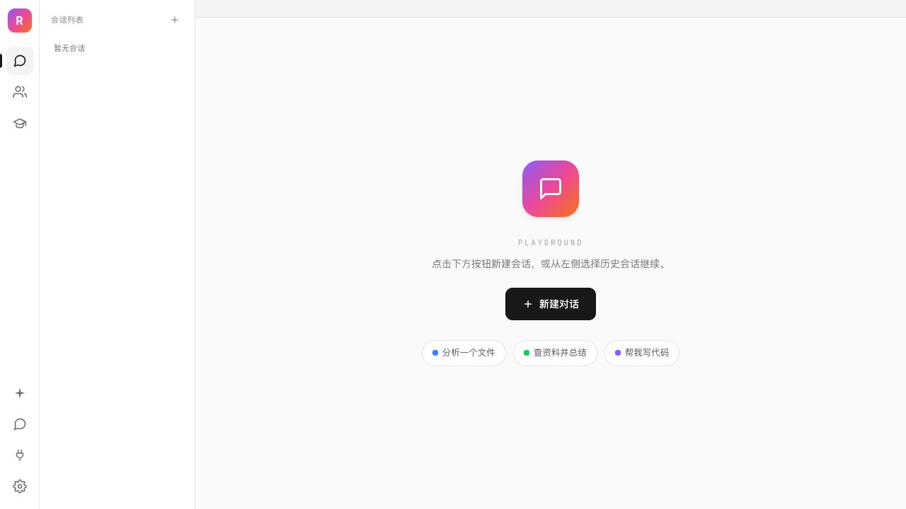
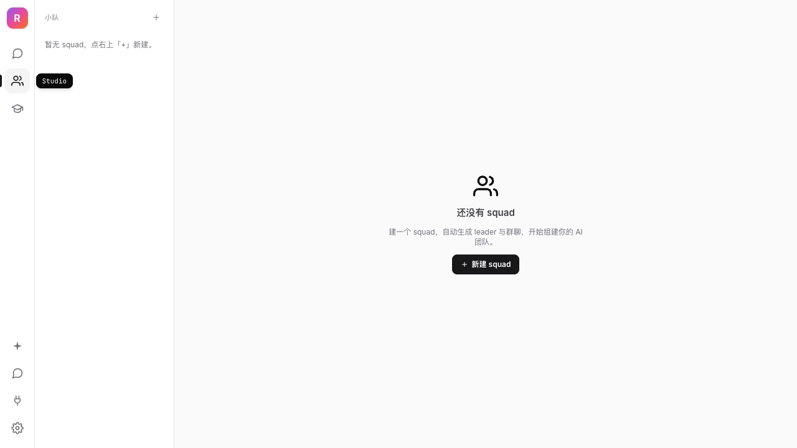
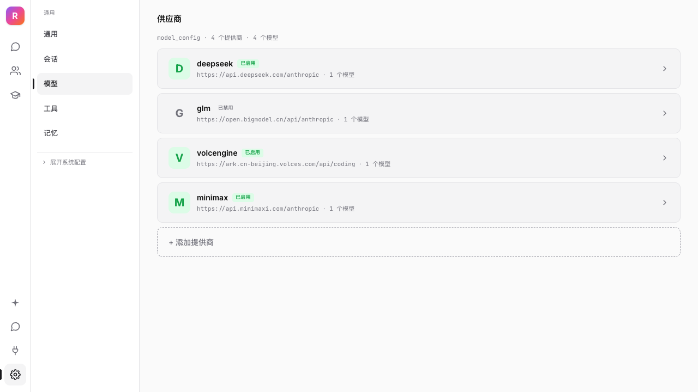
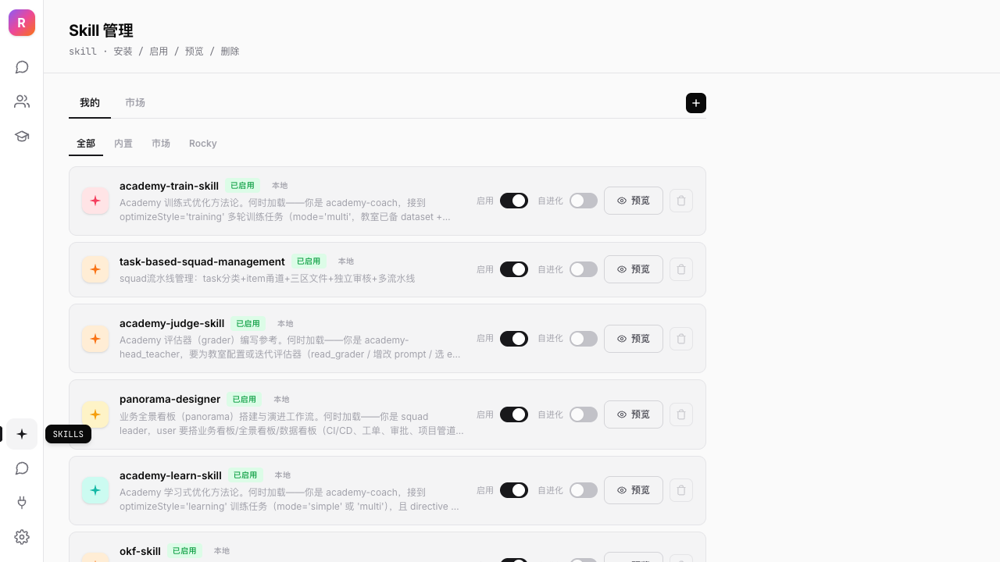
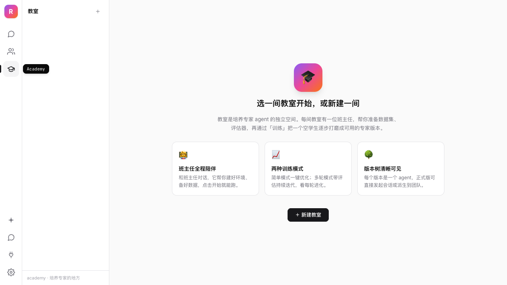

# Rocky Agent

> **在你桌面上，跑一队听你指挥的 AI agent。**

[](LICENSE)
[](https://github.com/eridani40/rocky_agent_pub/releases)
[](https://github.com/eridani40/rocky_agent_pub/actions/workflows/ci.yml)
[](https://github.com/eridani40/rocky_agent_pub/releases)
[](CONTRIBUTING.md)

[English](README.md) | 简体中文

<p align="center">
  
</p>

---

### 🏠 本地优先　·　🔒 零遥测　·　🧩 插件可扩展

Rocky Agent 是一个**桌面原生多 agent 编排器**。起一个 *leader* agent 派生并协调多个 *member* agent——每个都能有自己的模型、工具与记忆——全部用你自己的 LLM key 跑，每一字节数据都留在你机器上。

不经云中转、不收集使用数据、不锁你。

---

## ✨ 为什么用 Rocky Agent？

| | Rocky Agent | 常见 agent 工具 |
|---|---|---|
| 🏠 **本地优先** | 会话/密钥/配置全在本地 `DATA_DIR` | 云端托管，或自建 server |
| 🖥️ **桌面原生** | 双击 `.dmg` → 原生 macOS GUI | CLI / web UI / Docker |
| 🤝 **多 agent 内置** | Squad Studio：leader 派活给 member，SSE 同步 | 单 agent loop，或自己写编排 |
| 🔧 **TypeScript 可改** | 全 TS 代码，前端/全栈友好 | 多是 Python |
| 📐 **Spec 驱动** | 每个功能先在 `specs/` 写规格再编码，三层测试验证 | 测试是事后补的 |

---

## 🚀 特性

**🤝 agent 小队** —— leader agent 派生 member agent、分派任务、经 SSE 全员同步。member 继承上下文与已解析模型，异步回复、回报。整个团队可一键导出/导入为 zip——模板、成员、记忆与技能都在内。

**🧠 自带 LLM** —— Anthropic、OpenAI、MiniMax、GLM（智谱）、DeepSeek、OpenRouter，或任意 OpenAI 兼容端点。app 内一次配置；密钥除 `DATA_DIR` 外不落任何地方。

**📄 文件预览 + 编辑** —— 从工作区文件树或聊天链接把文件打开进预览栏：多 tab、内置编辑器，支持 markdown 渲染、结构化格式（JSON/YAML/XML/TOML/CSV/TSV）格式化与校验、纯文本文件（`.env`/`Dockerfile`/`Makefile`/…）、图片预览。保存带版本校验——外部改动会弹 409 冲突对话框（重载 / 强制覆盖），编辑态守卫保护未保存内容。

**🚪 门模型布局** —— chat↔预览 的分隔是一扇可横向滑动的三态门：分栏、文档占满、对话占满。一键切换，per-session 持久化，布局永不移位。

**🔍 工作区搜索** —— 防抖 + 后端驱动的全工作区搜索，带裁剪式结果树——不离开当前流程就能找到并打开任意文件。

**🖱️ Computer Use** —— agent 截屏并通过原生 loopback 通道点击/输入——自动化真实 app，不只是沙箱。

**🛠️ 工具 + HITL 审批** —— `file`、`bash`、`web_fetch`、`cron`、`search`、`ask_question`；高风险动作需人工放行。

**🧩 技能 + 插件** —— 内置技能市场 + TypeScript 插件系统：声明一个扩展点，就能加新的 provider、工具、上下文源、技能或 channel。

**🔄 全实时** —— SSE 驱动的实时 UI：任务看板、todo 面板、cron 面板、团队状态、会话未读、工作区文件变化——无需手动刷新。

**💾 记忆 + 历史** —— 跨会话持久记忆 + 全文搜索每一段对话。

**🎓 Academy** —— 在 app 内训练、评估、打磨你自己的 agent。

---

## 🎬 截图

<table>
  <tr>
    <td align="center"><b>Playground</b><br/></td>
    <td align="center"><b>Squad Studio</b><br/></td>
    <td align="center"><b>设置 · Providers</b><br/></td>
  </tr>
  <tr>
    <td align="center"><b>技能</b><br/></td>
    <td align="center"><b>Academy</b><br/></td>
  </tr>
</table>

---

## ⚡ 快速开始

### 方式 A — 下载（推荐）

从 [**Releases**](https://github.com/eridani40/rocky_agent_pub/releases) 下载最新 `Rocky.Agent-<version>-arm64.dmg`。

> **macOS 首次启动：** 右键 app → **打开**（绕过 Gatekeeper 对未签名构建的拦截）。

### 方式 B — 源码构建

```bash
git clone https://github.com/eridani40/rocky_agent_pub && cd rocky_agent_pub
bun install                       # 会顺带 playwright install chromium
cp dev.env.example dev.env        # 可选：预填默认值
bun run gen-version
bash scripts/run-dev.sh           # 后端 API + web 渲染层
```

需要 [Bun](https://bun.sh) ≥ 1.3 与 Node ≥ 22。

<details>
<summary><b>常见问题</b></summary>

- **`playwright install chromium` 失败** —— 浏览器 / Computer Use 功能将不可用。重试：`bunx playwright install chromium`。
- **端口被占用** —— 改 `dev.env` 里的 `API_PORT` / `WEB_PORT`（默认 3710 / 8788）。
- **macOS 权限弹窗** —— Computer Use 需在 *系统设置 → 隐私与安全性* 授予屏幕录制与辅助功能权限。
</details>

### 配置 LLM 密钥

启动 app → **设置 → Providers** → 选 provider → 粘贴 API key。本地存储，**只**发往你选的那个 provider。

---

## 🧩 插件

一个插件 = 一份清单（`plugin.json`）+ 注册到具名**扩展点**的 TypeScript 实现。最小真实示例（取自 `app/plugins/builtins/skills_sh/`）：

```json
{
  "id": "skills_sh",
  "label": "Shell Skills",
  "extImpls": [
    { "implId": "skills_sh", "point": "skill_market_provider", "impl": "./skills-sh-provider.ts" }
  ]
}
```

内置扩展点：LLM provider、工具、上下文源、技能、channel。完整契约 → [`specs/tech/plugin_system/`](specs/tech/plugin_system/)。

---

## 🏗️ 架构

```
app/
├── electron/         # 桌面外壳 · 主进程 · 零密钥运行时配置注入
├── web/              # React + Vite 渲染层（聊天、squad studio、设置）
├── server/           # Bun HTTP API · agent loop · 工具 · node:sqlite 持久化
├── protocols/        # 共享 IPC + HTTP 契约类型
├── shared/           # 跨包工具
└── computer-native/  # 原生辅助（截屏、辅助功能）
```

单个 `server` 进程跑 agent loop（LLM 调用 → 工具派发 → SSE 流），编排 squad，一切持久化到 SQLite。工具执行走 **worker pool**（`worker_threads`）异步化——重工具（bash、文件操作、搜索）不阻塞事件循环。Electron 主进程托管渲染层，向打包后的 app 注入**零密钥**运行时配置。

---

## ⚙️ 配置

路径与端口走环境变量；**LLM 密钥在 app 内配置，不走 env。**

| 变量 | 默认值（prod） | 用途 |
|------|----------------|------|
| `API_PORT` | `3720` | 后端 HTTP API 端口 |
| `WEB_PORT` | `8789` | 渲染层端口（仅 dev） |
| `DATA_DIR` | `~/.rocky_agent_prod` | 会话 / 密钥 / 插件配置根目录 |
| `APP_ENV` | `prod` | `dev` / `test` / `prod` 隔离 |
| `LOG_LEVEL` | `warn` | `debug` / `info` / `warn` |
| `HTTP_PROXY` / `HTTPS_PROXY` | — | 出站 LLM 调用代理 |

完整 schema：[`dev.env.example`](dev.env.example) · [`prod.env.example`](prod.env.example) · [`test.env.example`](test.env.example)。

---

## 🔒 隐私

**零遥测，设计如此。**

- 无使用统计、无崩溃上报、无 phone-home。
- 每个会话、密钥、配置都留在你机器的 `DATA_DIR`。
- **唯一**出站流量只发往你配置的 LLM provider——别无他处。

---

## 🗺️ 路线图

- ⬜ 跨平台构建（Windows · Linux · macOS Intel）
- ⬜ 插件市场发现与安装
- ⬜ 更多 Computer Use 动作与可靠性
- _（见 [open issues](https://github.com/eridani40/rocky_agent_pub/issues)）_

---

## 🤝 贡献

欢迎 PR！本仓库遵循 **spec 驱动** 工作流——功能先在 [`specs/`](specs/) 设计、再编码，经三层测试管线（单元 + 真实 LLM API + agent 玩 app 的 E2E）验证。

- [`CONTRIBUTING.md`](CONTRIBUTING.md) — 入门
- [`AGENTS.md`](AGENTS.md) — 完整 AI 开发方法论
- [`specs/`](specs/) — 设计体系

---

## 📄 协议

[MIT](LICENSE) © eridani40

---

<!-- ## ⭐ Star History — 首次公开发布后加 -->
